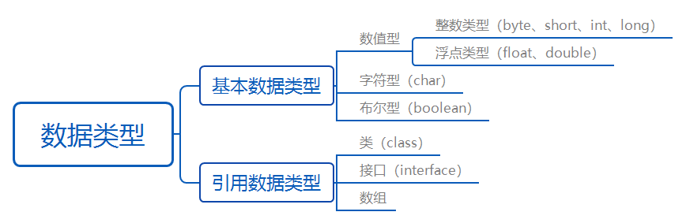

## 一、Java入门

1. 优势：跨平台、可移植性
2. 高性能、面向对象、简单性、分布式、多线程、健壮性
3. 第一个Java例子
```java
	public static void main(String[] args){
	/*
	1.main方法，是一个程序执行的入口，每次程序执行都从这个方法开始。对于这个特殊的方法主要有两个特点：
		（1）格式固定
		（2）被jvm识别和调用
	2.public：因为权限必须是最大的。它是访问修饰符之一
	3.static：不需要对象，直接用主函数所属类名调用即可。static关键字，被它修饰的方法叫静态方法。
	4.void：表明main方法没有具体的返回值。
	5.Stringp[] args：这是main方法的参数列表，是一个数组类型的参数，而且元素都是字符串类型的。
	6.arg是arguments的缩写。
	*/
		System.out.println("我是videjin，大家好！");
		//这句话是非必须的，输出语句，作用只是在控制台打印这么一句话。
	}
	
```
4. java的终端（命令行）编译
   （1） dos命令 cd 打开Java文件所在目录
   （2）编译文件：javac xxx.java
   （3）运行文件：java xxx
   
   >编译文件生成xxx.class文件，就是运行时的文件，在bin目录中。

## 二、注释

>注释不会被执行，Java中有三种类型注释
1. 单行注释
	+ " // "开头，之后内容
2. 多行注释
	+ 以" /\* " 开头，以" \*/ "结尾
	+ 不可嵌套（无意义）
	+ 可做行内注释
3. 文档注释
	+ 以" /\*\* "开头，以" \*/ "结尾
	+ 可生成项目的API  

案例：
```java
	/**
	*这里是文档注释
	*/
	public class Welcome{
		public static void main/*这里是行内注释*/(String[] args){
		
			//下面是打印语句。输出双引号中的内容
			System.out.println("我是videjin！");
			System.out.println("你好！");
			/*
			前进！
			无所畏惧
			*/
			System.out.println("加油！");
		}
	}
```
## 三、标识符

>给变量、类、方法以及包进行命名
1. 遵守规则
    + 开头: 
      + ①字母 
      + ②下划线\_ 
      + ③美元符号$
    + 其他不部分:
      + ① 字母 
      + ②下划线\_ 
      + ③美元符号$ 
      + ④ 数字 （不能作为开头）的任意组合
    + Java标识符大小写敏感、长度无限制
    + 不可以是Java的关键字

>Java采用Unicode标准国际字符集(2个字节表示一个符号,2¹⁶=65536,中文一万多,英文26个字母,其他语言等等都可包含),而不是ASCII字符集(1个字节,1个字节2⁸=256)。故字母不仅仅包含英文,还包含汉字等等。但是不建议使用汉字。

2. 关键词  
   
   | abstract   | assert  | boolean   | break     | byte       | case         |
   | :---------- | :------- | :--------- | :--------- | :---------- | :------------ |
   | catch      | char    | class     | const     | continue   | default      |
   | do         | double  | else      | extends   | final      | finally      |
   | float      | for     | goto      | if        | implements | import       |
   | imstanceof | int     | interface | long      | native     | new          |
   | null       | package | private   | protected | public     | return       |
   | short      | static  | strictfp  | super     | switch     | synchronized |
   | this       | throw   | throws    | transient | try        | void         |
   | volatile   | while   |           |           |            |              |
   
>关键词不需要背，实战中自然熟悉  

3. 使用规范
   + 驼峰规则
   + 类：每个单词首字母大写，如Man
   + 方法或变量：第一个单词小写，从第二个字母开始首字母大写，如eat()，eatFood()  

## 四、变量（Variable）

1. 变量本质
   + 可操作的存储空间，如停车场的车位
   + 空间有大有小，如int是4个字节
   + 通过变量名访问对应存储空间，从而操作存储的值
   + Java是一种强类型语言，每个变量都必须声明其数据类型。数据类型决定变量占据存储空间的大小。  

2. 变量的声明

```java
	type varName[=value][,varName[=value]...];
	//[]中的内容为可选项，即可有可无
	数据类型 变量名 [=初始值][,变量名[=初始值]...]
	
	//eg.
	double salary;//8byte
	long earthPopulation;//8byte
	int age;//4byte
	//一个字节8位（1byte=8bit）
```

3. 注意事项
   + 每个变量都有类型。可是基本类型，也可是引用类型。
   + 变量名必须是合法的标识符。
   + 变量声明是一条完整的语句，因此每一个声明必须以分号(;)结束。
   + 局部变量（方法中的变量）变量使用前进行初始化
   + 可以一行声明多个变量，但不提倡
```java
	//不提倡
	int i, j;//两个变量的数据类型都是int
	//提倡
	int i = 0;
	int j = 0;
```
4. 变量的分类和作用域

   > 整体上分局部变量、成员变量（实例变量）、静态变量  
   | 类型 | 声明位置 | 从属于 | 生命周期（作用域）|
   | :----: | :---: | :---: | :----: |
   | 局部变量 | 方法或语句块内部|方法/语句块|从声明位置开始，直到方法或语句块执行完毕，局部变量消失|
   | 成员（实例）变量 | 类内部，方法外部|对象|对象创建，成员变量也跟着创建；对象消失，成员变量也跟着消失|
   |静态（类）变量|类内部，static修饰|类|类被加载，静态变量就有效；类被卸载，静态变量消失|

   （1）局部变量（local variable）
   + 使用前必须声明、初始化（赋初值）

   （2）成员变量（member variable）  
   
   + 如果不自行初始化，它会自动初始化成该类型的默认初始值。
	
   （3）静态变量（static variable）
   
   + 如果不自行初始化，与成员变量相同会自动初始化成该类型的默认初始值。

| 数据类型|初始值|
|:----:|:----:|
|int|0|
|double|0.0|
|char|'\u0000'|
|boolean|false|

例子：
```java
	public class VariableTest{
		int classroom;//成员变量
		static int world;//静态变量
		public static void main(String[] args){
			int i;//局部变量的声明
			i = 0;//初始化，赋初值
		}
	}
```

## 五、常量（Constant）

1. 定义：固定的值（停车场中的专用车位）

2. 在Java中，主要用关键字final来定义一个常量。

3. 常量一旦被初始化后不能再更改其值。

4. 声明格式为

   final type varName = value;

```java
	public class TestConstants{
		public static void main(String[] args){
			final double PI = 3.14;//常量PI不能再变
			double r = 0;
			r = 3;//变量可以变
			double area = PI*r*r;
			double circle = 2*PI*r;
			System.out.println("面积是："+area);
			System.out.println("周长是："+circle);
		}
	}
```
>常量分字符常量（普通符号，如2、3、true等）和符号常量（final修饰的）。
>变量和常量命名规范
>>+ 所有变量、方法、类名：见上文。
>>+ 类成员变量：首字母小写和驼峰原则：mouthSalary  

## 六、数据类型（data type）

>java强类型语言，每个变量必须声明数据类型。Java的数据类型分为两大类：基本数据类型（primitive data type）和引用数据类型（reference data type）。

1. Java中定义了3类8种基本数据类型
   【1】数值型：byte（1个字节）、short（2）、int（4）、long（8）、float（4）、double（8）
   【2】字符型：char（2）
   【3】布尔型：boolean（一般是4，在数组中是1）
   
   
   
>引用数据类型的大小统一为4个字节，记录的是其引用对象的地址！
>1个字节（byte）=8位（bit）=2⁸信息

### 1. 整型

1. 概述
   + 用于表示没有小数部分的数值，可为负数
   + 范围与Java代码机器无关，这正是Java程序具有强移植性能力的原因之一。与此相反，C和C++程序需要针对不同的处理器选择最有效的整型。  

| 类型|占用存储空间|表述范围|
|:----:|:---:|:----:|
|byte|1字节|-2⁷~2⁷-1（-128~127）|
|short|2字节|-2¹⁵~2¹⁵-1（-32768~32767）|
|int|4字节|-2³¹~2³¹-1（-2147483648~2147483647）约21亿|
|long|8字节|-2⁶³~2⁶³-1|

2. 要点
   + Java语言整型常量的四种表示形式
      + 十进制整数，如：99、-500、0
      + 八进制整数，要求以0开头，如：015
      + 十六进制整数，要求0x或0X开头，如：0x15
      + 二进制数，要求0b或者0B开头，如：0b01110011  

>Java语言的整型常数默认为int型,声明long型常量可以后加'l'或'L'。  

例子:
```java
	public class TestInt{
		public static void main(String[] args){
			byte a = 100;
			int b = 5030303;
			int c = 05;//八进制
			int d = 0x15;//十六进制
			int e = 0B101011;//二进制
			long f = 55555555555L;//将整型常量定义为long类型
		
			System.out.println(e);//显示e的十进制值
		}
	}
```
### 2.浮点型（Flating Point Number）

1. 概述
   + 定义：带小数的数据
   + 分为：float、double   

| 类型 | 占用存储空间| 表述范围|
|:----:|:----:|:----:|
| float|4字节|-3.403E38~3.403E38|
|double| 8字节|-1.7998E308~1.7998E308|

2. 要点
   + float 类型又称单精度类型，尾数可精确到7位有效数字
   + double是双精度类型，float精度的两倍，故常用double类型。  
   + Java浮点类型常量有两种表示形式
      + 十进制数形式，如：3.14、314.0、0.314
      + 科学计数法形式，如：3.14e0、3.14E2、3.14E-1 
   + float类型的数值有一个后缀F或f，没有后缀F/f的浮点数值默认为double类型。
   + 在浮点数值后加后缀D或d，则为double类型。 

>浮点类型float、double的数据不适合在不容许舍入误差的金融计算领域。如需进行不产生舍入误差的精确数字计算，需使用BigDecimal类。

例子：
```java
	public class TestFloatNumber{
		public static void main(Sting[] args){
			double d1 = 3.14;
			double d2 = 3.14E2;//科学计数法表示小数314.0
			
			System.out.println(d2);
			//float f1 = 1.65; //会报错，因1.65默认为double类型，不能直接赋值给float。
			//!!!浮点数是不精确的，尽量不要直接进行比较。
			float f2 = 1.65F;
			float f3 = 0.1F;
			double d3 = 1.0/10;
			
			System.out.println(f3==d3);//flase!一个=号是赋值；两个==是比较运算。
			float f4 = 23432432443F;
			float f5 = f4 + 1;
			
			System.out.println(f5==f6);//turef!
		}
	}
```

### 3.字符型

1. 概述
   + 在内存中占2个字节
   + 在Java中使用单引号来表示字符常量。如：'A'表示一个字符；与"A"是不同的，"A"表示含有一个字符的字符串。
   + char类型用来表示Unicode编码表中的字符。Unicode编码被设计用来处理各种语言的文字，它占2个字节，可允许有65536个字符。（ASCII是1个字节）
   + 字符型演示
```java
	char eChar = 'a';
	char cChar = '中';
```
2. 要点
   + 除了用字符，也可用编码。Unicode具有从0到65535之间的编码，他们通常从'\u0000'到'\uFFFF'之间的十六进制值来表示（前缀为u表示Unicode）。（'\uFFFF'中两个F相当于一个255）
   + 字符型的十六进制值表示方法
```java
	char c = '\u0061';
```

3. 转义字符
```java
	char c = '\n';
```

|转义符|含义|Unicode值|
|:----:|:----:|:----:|
|\b|退格（backspace）|\u0008|
|\n|换行|\u000a|
|\r|回车|\u000d|
|\t|制表符（tab）|\u0009|
|\"|双引号|\u0022|
|\'|单引号|\u0027|
|\\|反斜杠|\u005c|

>以后我们学的String类，其实是字符序列（char sequence），本质是char字符组成的数组。

例子：
```java
	public class TestChar{
		public static void main(String[] args){
			char c1 = 'a';
			char c2 = '中';//不能是中国，中国为字符串，中为字符
			char c3 = '\u0061';
			String str = "中国";//Java中的字符串不是基本数据类型，而是一个独立定义的类。
			
			System.out.println(c1);
			System.out.println(c2);
			System.out.println(c3);
			System.out.println(str);
			
			//转义字符
			char c4 = '\n';
			System.out.println("a\nb\nc\nd\te\tf\tg,\",\',\\");
            }
	}
```

### 4.boolean型

1. 概述
   + boolean类型有两个常量值，true和false，在内存中占1个字节或4个字节。不可以使用0或非0的整数替代true和false，这点和C语言不同。
   + boolean类型用来判断逻辑条件，一般用于程序流程控制。
   + boolean类型演示
```java
	boolean flag;
	flag = true; //或者flag = false;
	if(flag){
		//true分支
	}else{
		//false分支
	}
	/*
	less is more !
	不要这么写：if (flag == true)，只有新手这么写，关键也容易写错成if (flag = true)，这样就变成赋值flag为true而不是进行比较。
	故应写成if(flag)或者if(!flag)
	*/
```
例子：
```java
	public class TestBoolean{
		public static void main(String[] args){
		boolean b1 = true;
		boolean b2 = false;
		
		if(b1){
			System.out.println("b1是true");
		}else{
			System.out.println("b1是false");
		}
		}
	}
```
>boolean类型单独使用时4个字节，在数组中是确定的1个字节。  

## 七、运算符（operator）

1. 定义：计算机的最基本用途之一就是执行数学运算
2. 分类

|类型|符号|
|:----:|:----:|
|算术运算符：二元运算符|+，\-，*，/，%|
|算数运算符：一元运算符|++，--|
|赋值运算符|=|
|扩展运算符|+=，-=，\*=，/=|
|关系运算符|>，<，>=，<=，==，!= instanceof|
|逻辑运算符|&&，||，！，^|
|位运算符|&，|，^，~，>>，<<，>>>|
|条件运算符|?:|
|字符串连接符|+|

### 1. 算术运算符

1. 二元运算符

   + 二元运算符指的是需要两个操作数才能完成运算的运算符。其中%是取模运算符，即求余数操作。
      + 整数运算：
         + 如果两个操作数有一个为long，则结果也是long
         + 如果没有long时，结果为int。即使操作数全是short、byte，结果也是int。
      + 浮点运算：
         + 如果两个操作数有一个为double，则结果为double。
         + 只有两个操作数都是float，则结果才为float。
      + 取模运算
         + 其操作数可以为浮点数，一般使用整数，结果是"余数"，"余数"符号和左边操作数相同，如：7%3=1，-7%3=-1，7%-3=1。

例子：
```java
	public class TestOperator{
		public static void main(String[] args){
			//算数运算符
			int a = 3;
			long b = 4;
			int c = a + b;//会发生错误：不兼容类型，从long转换到int
			
			System.out.println(c);
			
			//取余数
			int e = 10%3;
			System.out.println(e);
			
			//自增、自减
			int g = 30;
			g++;//相当于：g = g + 1;
			g--;//相当于：g = g - 1;
		}
	}
```

2. 一元运算符

   - 定义：算术运算符中++（自增），--（自减）
   - 只需要一个操作数
   - 案例
```java
	int a =3;
	int b = a++;//执行完后b=3。++在操作数后，先赋值再自增。
	
	a = 3;
	b = ++a;//执行完后b=4。++在操作数前，a先自增然后再给b赋值。
```

### 2. 赋值及其扩展赋值运算符

| 运算符|用法举例|等效的表达式|
|:----:|:----:|:----:|
|+=|a += b|a = a + b|
| -= | a -= b| a = a - b|
|\*=| a \*= b | a = a \* b|
|/=| a /= b | a = a / b |
| %= | a %= b| a = a % b|


```java
	public class TestOperator02{
		public static void main(String[] args){
			int a = 3;
			int b = 4;
			a += 4; //等价于：a = a + b;
			System.out.println(a);// 7
			
			a = 3;
			a *= b + 3; //等价于：a = a*(b+3);
			System.out.println(a);//21
		}
	}
```

### 3. 关系运算符

1. 用处
   + 用来进行比较运算，关系运算的结果是布尔值：true/false：

| 运算符 | 含义| 示例|
|:----:|:----:|:----:|
| == | 等于 | a == b |
| != | 不等于 |a != b|
| >| 大于|a > b|
| <|小于|a < b|
|>=|大于或等于|a >= b|
|<=|小于或等于|a <= b|

2. 注意事项
   + =是赋值运算符，而真正的判断两个操作数是否相等的运算符是==。
   + ==、!=是所有（基本和引用）数据类型都可以使用的。
   + \>、>=、<、<=仅针对数据类型（byte/short/int/long，float/double以及char）。

```java
	public class TestOperator03{
		public static void main(String[] args){
			
			//比较运算符
			int a = 3;
			int b = 4;
			boolean c = a > b;
			System.out.println(c);//false
			
			//char也能用于关系运算符的比较
			char d = 'h';
			System.out.println((int)d);//104,h对应的数是104（0~65535），char值位于0~65535之间。通过（int）强制转为int，可以看到对应的数字
			System.out.println(d > 100);//true
		}
	}
```


### 4. 逻辑运算符

1. 概述
   - java中逻辑运算符的操作数和运算结果都是boolean值。

| 运算符|运算符|说明|
|:----:|:---:|:----:|
|逻辑与|&（与）|两个操作数为true，结果才为true，否则是false|
|逻辑或|\|（或）|两个操作数有一个是true，结果就是true|
|短路与|&&（与）|只要有一个为false，则直接返回false|
|短路或|\|\|（或）|只要有一个为true，则直接返回true|
|逻辑非|!（非）|取反：!false为ture，!true为false|
|逻辑异或|^（异或）|相同为false，不同为true|

2. 注意事项
   - 短路与 和 短路或 采用短路的方式。从左到右计算，如果只通过运算符左边的操作数就能够确定该逻辑表达式的值，则不会继续计算运算符右边的操作数，提高效率。

```java
	public class TestOperator04{
		public static void main(String[] args){
			
			//测试逻辑运算符
			boolean b1 = true;
			boolean b2 = false;
			System.out.println(b1 & b2);//结果：false
			System.out.println(b1 | b2);//true
			System.out.println(!b2);//true
			System.out.println(b1 ^ b2);//true
			
			//短路与、短路或
			//int g = 3/0; //0不能作为除数，会报错
			boolean b3 = 1 > 2 && (4 < 3/0); //结果：false，后边虽然0为除数，但未进行运算。
			System.out.println(b3);
		}
	}
```
### 5. 位运算

1. 概述
   - 定义：进行二进制位的运算
   - 常见的位运算：

|位运算符|说明|
|:----:|:----:|
|~|取反|
|&|按位与|
|\||按位或|
|^|按位异或|
|<<|左移运算符，左移1位相当于乘2|
|\>>|右移运算符，右移1位相当于除2取商|

```java
	public class TestOperator05{
		public static void main(String[] args){
			int a = 7;//二进制：00111
			int b = 8;//二进制：01000
			
			System.out.println(a & b);//0
			System.out.println(a | b);//15
			System.out.println(a ^ b);//15
			System.out.println(~b);//-9，补码操作
			
			//移位运算
			int c = 5 << 2;//相当于：5*2*2=20
			System.out.println(c);//20
			System.out.println(40 >> 3);//相当于40/2/2/2=5
			//3*2怎么运算最快，左移一位：3<<1
		}
	}
```

