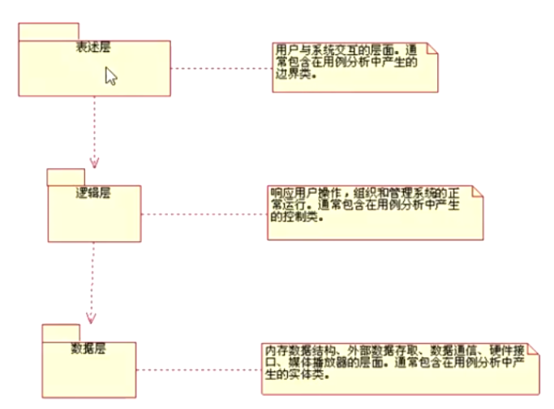

## 0629进入精华阶段

1. 概述
   1. TS（做什么、产品目标）
      + 用例建模：模型图+用例阐述（软件实现规约）
      + Use Case View

   2. OOAD（怎么做）
      + Logical View

### 关键内容

#### 一、 软件架构【Archltecture】
>定义：结构化解决方案 与软件开发过程的生命周期模型有关系  架构师：软件架构设计说明

   1. 简介

   2. 构架表示方式   RUP的四个View
   
   3. **关键用例**（视图）  ~~登录：与其他权限用例之间的使用关系~~（不能作为关键用例）【关键用例模型+各用例的解释】
      key usecase ：指具有特点的，体现系统本身**不同于**其他系统的功能。
       YDOSP：内容管理-->分类、内容编辑、频道 ......
      引申：关键测试用例  
      
   4. 层次（Layers）结构 【包图】
      与软件（层次）设计模式有关【~~类-->单例~~】
      
        
      
   5. 关键抽象类 ：指具有特点的，体现系统本身**不同于**其他系统的类。【类图】
      
      
      
   6. 逻辑视图（Logical View）【OOAD】

#### 二、 设计模式
>定义：描述普遍存在的在相互通讯的组件中重复出现的结构，这种结构解决在一定的背景中的具有一般**（通用与关键用例不同[相反]）**性的设计问题。 【如：MVC】 

1. 设计模式的目的：指导编码的思想，反之，对架构设计也有影响。
2. MVC：将软件编码分解为三部分-->Model（数据、属性）、View（展示）、Controlle（【控制层】接受处理数据、逻辑处理）。
3. 实例：kalaOK（led）

#### 三、OOAD